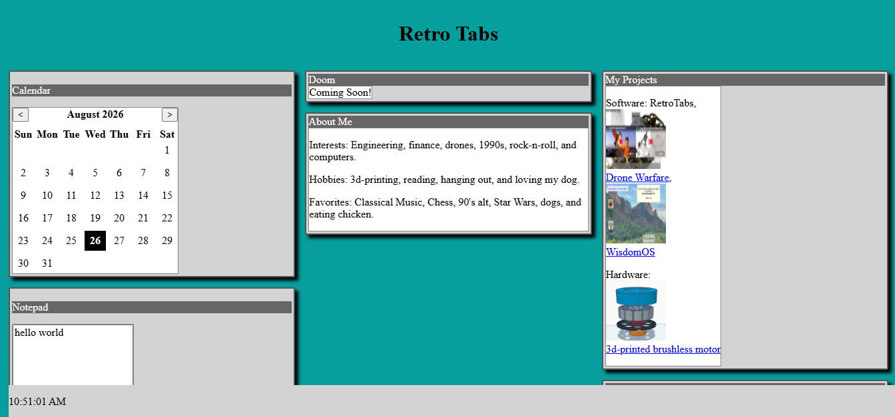
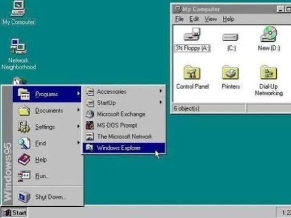

# RetroTabs
A retro feeling tab using guide to allow you the feel of 1990's intenet with acsess to 2026 tech.

https://bdlloyd83.github.io/RetroTabs/
Retro tabs is my personal os-like website that gives the user a variety of features and functions from the 
calendar
clock
notepad
games(coming soon)
about me
contact
and projects.

The theme of the website was some windows 95 feeling or theme. I did this to allow people to be transported back to the 90s with the explosion of new technology thats advancing fast to help them feel like their living in the gold rush of technology.

Inspiration for this project--Windows 95
